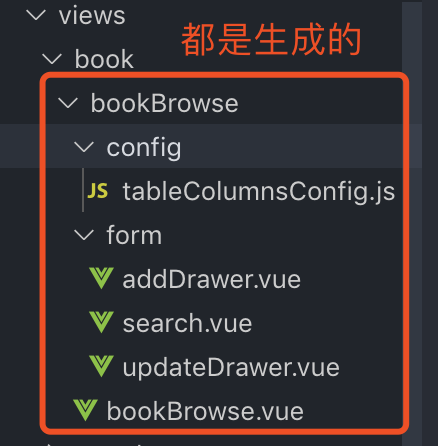

### pumpkin-vue-framework文档


pumpkin-vue-framework可根据数据库分模块，按字段自动生成前端模板代码，综合提高40%以上开发速度，代码规范率提高80%以上，前端使用Vue全家桶，组件库采用[iView](https://www.iviewui.com/)

### 项目地址
[演示地址（dev环境）](http://42.48.104.46:15012/framework/#/user/index)

演示环境账号密码：与门户相同
比如：用户名19973125432 密码qwe123456

### 系统预览

1. 登陆页面


2. 忘记密码页面


3. 用户中心模板页面


4. 换肤功能


5. 菜单栏


### 项目简介
1. 项目中主要使用Vue、es6、scss技术开发，使用iview开源组件库

2. 页面主要有用户登陆、忘记密码、以table列表的形式展示数据以及数据的增删改查

3. 框架的开发主要是用于：

        a.根据数据库的分模块按字段自动生成前端模板代码，提高40%以上的速度开发，代码规范率提高80%以上
        b.让新手以及后端人员可以快速上手开发在此系统基础上相似后台系统，提高团队开发速度，解放前端开发人员
    
### 文件结构

1. api文件夹主要是项目的api集中管理的，里面按照后台模块严格分块，名字按照‘API_’加上后台模块名，比如：‘API_USER’

2. src/assets文件夹主要放项目的静态文件：

        constant:存放项目的常量
        images:存放项目的图片，里面按照模块或者特殊功能命名文件夹存放对应图片
        js:存放公用的js方法
        mixins:存放组件的公用方法
        style:存放项目样式相关,其中theme.scss为主题文件，所有和主题色有关的样式都需要以模块为单位写在里面

3. components文件夹主要是项目的组件：

        模块开发的组件命名方式：文件夹以后端的模块命名，文件命名用‘模块-功能名’

4. icon文件夹是放svg格式的icon

5. layout文件夹是存放项目的布局相关文件

6. request文件夹是存放axios的封装文件

7. router文件夹是存放路由相关文件，文件命名依据当前模块


        
        每一个路由组件的引路都需要有/* webpackChunkName: 'user' */注释用来标识打包后的代码来源

8. views文件夹是存放项目页面：（主要就是代码生成器生成的模板文件）


        模块开发的组件命名方式：最外层文件夹以后端的模块命名，里面一层文件夹取对应路由命名，比如news/message，最外层文件夹就是news，里面文件夹就是message。
        config存放table相关的配置，会自动生成，需手动删除多余字段
        form里是增加、编辑的抽屉式弹窗以及查询功能，会自动生成，需手动修改接口相关和删除多余字段
    

### 模板生成使用教程
目前使用的是李涛提供的emerge项目，拿到项目之后，在终端输入：cnpm install安装依赖(这里推荐用淘宝镜像安装)，完毕后输入npm run serve启动项目,代码生成依赖JDK，需要安装


第二步生成需要的代码，操作如下：

生成的文件如下：


### pumpkin-vue-framework使用教程

在SVN拉取项目之后，在终端输入：npm install安装依赖，完毕后输入npm run serve启动项目

http://10.51.72.6:8080/framework/#/login 即可访问

1. 把上面代码生成器生成的代码文件夹放到项目中，如下：
book模块的放book文件夹里面=>


2. 代码生成器格式eslint不严格，所以在终端执行npm run lint 格式化代码，如下：


3. 增加book模块的路由，在router文件夹下新增book.js
```javascript
const bookBrowse = () => import(/* webpackChunkName: 'bookBrowse' */ '../views/book/bookBrowse/bookBrowse.vue')

export default {
  base: '/',
  routes: [
    {
      path: '/book/browse',
      name: 'book/browse',
      component: bookBrowse,
      meta: {
        requireLogin: true
      }
    }
  ]
}
```

4. 在菜单栏增加新路径

就生成前端页面，数据把接口API更改就OK啦


5. 注意事项：

    a.页面生成后search表单、新增抽屉表单、修改抽屉表单默认都是input，需要业务需求手动替换。

    b.表格默认展示数据库所有字段，需要根据业务调整和删除，表格间距也需要手动调整
